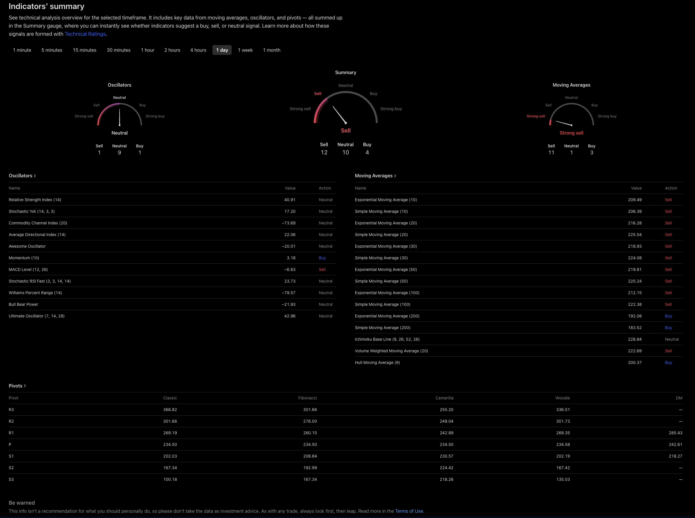
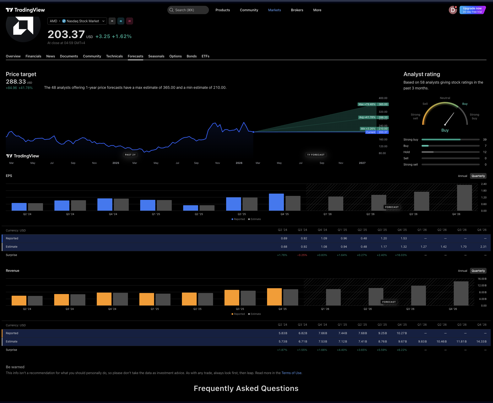
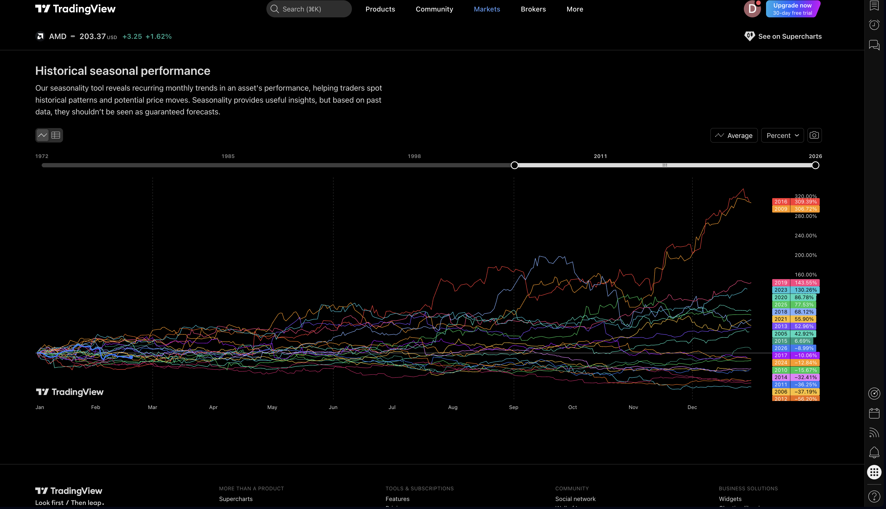
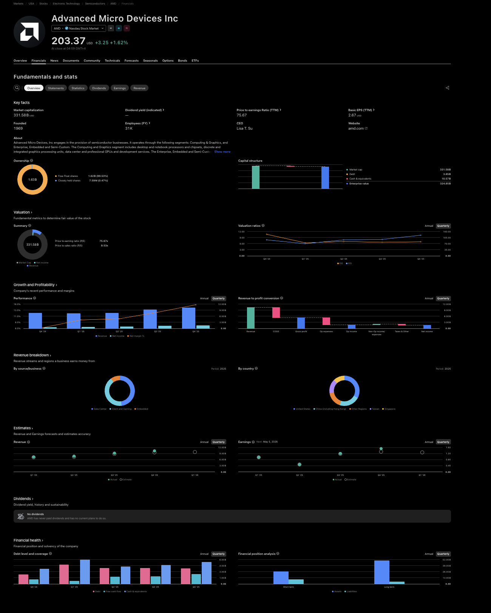
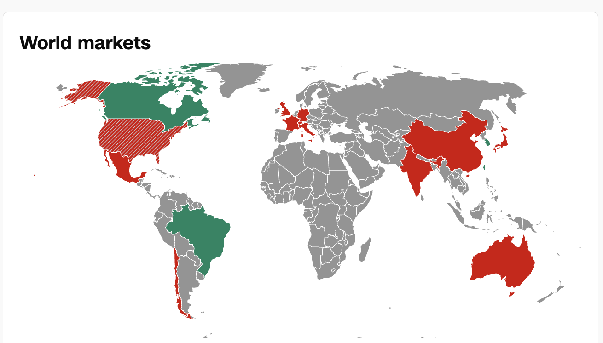
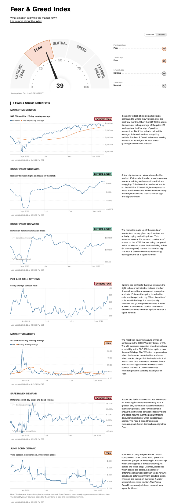

# Stock app

**Purpose.** This project is open source and aims to help **individual long-term investors** (not traders) make better decisions by:

- **Visualized guidance** — Clear charts and dashboards so you can see what’s going on at a glance.
- **Visualized indicators** — Economic and market metrics explained in plain language: what they are, what they mean, and how to read them.
- **Context on valuation and sentiment** — Whether markets or assets look overpriced, underpriced, in fear, in greed, or in fair-value territory — for **stocks and ETFs** alike.

The app is built to be **beautiful**, easy to use, and focused on **long-term investing** rather than short-term trading. Nothing here is financial advice; it’s a tool for learning and informed decision-making.

### Access & AI tiers (Ditectrev-style)

We want to offer the app in the same spirit as [Ditectrev’s Practice Tests Exams Platform](https://education.ditectrev.com) and its [pricing](https://education.ditectrev.com/pricing): **use it free with ads**, or choose how you get AI-powered enhancements:

| Tier | Description |
|------|-------------|
| **Free (ads-supported)** | Full access to visualized markets, indicators, and metrics. Ads help keep the project sustainable. |
| **Ads-free** | Same experience, no ads. |
| **Local (Ollama)** | AI enhancements run **on your machine** via [Ollama](https://ollama.com) — no data leaves your device; ideal for privacy and offline use. |
| **BYOK (Bring your own key)** | Use your own API keys for the provider of your choice: **OpenAI**, **Google Gemini**, **Mistral AI**, **DeepSeek**, etc. You control cost, data residency, and which model you use. Supports geographically distributed users and different **data governance** / **AI governance** / preference requirements. |
| **Our AI infrastructure** | Optional hosted AI (explanations, summaries, guidance) powered by our own stack — for users who prefer a single, integrated experience without managing keys. |

A dedicated **pricing** page (e.g. `/pricing`) will list these options clearly, like [education.ditectrev.com/pricing](https://education.ditectrev.com/pricing).

### Charts, news & community (TradingView-inspired)

- **[TradingView](https://www.tradingview.com)** is the benchmark for **beautiful charts** and a strong **News** section. We aim for a similar level of clarity and polish for long-term investors (without the trading focus).
- **[Seeking Alpha](https://seekingalpha.com)** — **favorite tool:** [Comparison](https://seekingalpha.com/comparison) (compare multiple symbols side by side). We also like their **sector comparison** tools ([Sectors hub](https://seekingalpha.com/sectors)): how sectors perform relative to each other. All sectors: [Technology](https://seekingalpha.com/sectors/technology), [Financial](https://seekingalpha.com/sectors/financial), [Consumer Discretionary](https://seekingalpha.com/sectors/consumer-discretionary), [Communication](https://seekingalpha.com/sectors/communication-services), [Healthcare](https://seekingalpha.com/sectors/healthcare), [Industrials](https://seekingalpha.com/sectors/industrials), [Consumer Staples](https://seekingalpha.com/sectors/consumer-staples), [Energy](https://seekingalpha.com/sectors/energy), [Materials](https://seekingalpha.com/sectors/materials), [Real Estate](https://seekingalpha.com/sectors/real-estate), [Utilities](https://seekingalpha.com/sectors/utilities). We also like how they present **dividend screeners** (e.g. [Top Dividend Stocks](https://seekingalpha.com/screeners/9679329c-Top-Dividend-Stocks)) — how dividends performed; a useful reference for income-focused views.
- **Seeking Alpha per-symbol pages** — clear **profitability** ([e.g. TSLA](https://seekingalpha.com/symbol/TSLA/profitability)), **growth** ([TSLA](https://seekingalpha.com/symbol/TSLA/growth)), **valuation** ([TSLA metrics](https://seekingalpha.com/symbol/TSLA/valuation/metrics)), and **earnings** ([TSLA](https://seekingalpha.com/symbol/TSLA/earnings)) with **color coding** when a metric is good or bad. We also like **comparison vs the market** the stock is listed on ([TSLA charting](https://seekingalpha.com/symbol/TSLA/charting)). Our favorite: **peer comparison** — how a stock stacks up vs peers ([TSLA vs peers](https://seekingalpha.com/symbol/TSLA/peers/comparison)); a strong reference for context and relative valuation.
- **What’s often missing: what the data means, and whether it’s good or bad.** Many tools show numbers and colors but don’t explain *what* each metric is or *why* it’s good or bad. We want to surface **plain-language explanations** — what the metric is, how to read it, and whether the value is favorable or not — so beginners can learn while they look.
- The **Community** side — explanations, “how to read this metric,” ideas, and guides — could be **contributed by GitHub users**: open, reviewable, and versioned like code.
- **Initial format for contributions: Markdown.** Markdown is familiar to GitHub users, trivial to edit and review in PRs, renders nicely in the app and in repos, and keeps the barrier to contribution low. We can add richer formats later if needed; starting with Markdown keeps the door open for maximum participation.

**App structure (MVP tabs).** For stocks we plan:

- **Overview**
- **Financials**
- **News** (later)
- **Community** (tentative, later)
- **Technicals** (essential)
- **Forecasts** (essential)
- **Seasonals** (super good for MVP)

That’s it — we keep the depth right for beginner investors and skip the rest. Other asset types (ETFs, etc.) get fewer tabs; we always include **Technicals**, **Forecasts**, and **Seasonals**.

**Planned features (nice to have & future):**

- [TradingView’s Economic Calendar](https://www.tradingview.com/economic-calendar/) — economic events, filters by country/importance (we have CNN’s economic-events endpoint for data).
- [TradingView’s Earnings Calendar](https://www.tradingview.com/earnings-calendar/) — upcoming earnings, EPS estimate vs actual, surprise.
- [TradingView’s Dividend Calendar](https://www.tradingview.com/dividend-calendar/) — dividend amount, ex-dividend date, payment date, yield; sortable by period/country/timezone.
- [TradingView’s IPO Calendar](https://www.tradingview.com/ipo-calendar/?countries=us) — e.g. US.
- [TradingView’s Macro Maps](https://www.tradingview.com/macro-maps/) — global macroeconomic trends.
- [TradingView’s Yield Curves](https://www.tradingview.com/yield-curves/) — explore and compare yields by country and tenor.
- **Heatmaps** — ETF, Crypto, and Stock heatmaps (TradingView-style) for at-a-glance market views.
- **Sector comparison** — [Seeking Alpha–style sector pages](https://seekingalpha.com/sectors): Technology, Financial, Consumer Discretionary, Communication, Healthcare, Industrials, Consumer Staples, Energy, Materials, Real Estate, Utilities — comparing how sectors performed; at-a-glance relative performance.
- **Dividend screeners** — [Seeking Alpha–style dividend presentation](https://seekingalpha.com/screeners/9679329c-Top-Dividend-Stocks) (e.g. Top Dividend Stocks): how dividends performed; useful for income-focused, at-a-glance views.
- **Symbol comparison tool** — [Seeking Alpha–style Comparison](https://seekingalpha.com/comparison): compare multiple symbols side by side; a strong reference for head-to-head analysis.
- **Per-symbol fundamentals & peer comparison** — [Seeking Alpha–style](https://seekingalpha.com/symbol/TSLA/profitability) profitability, growth, valuation, and earnings with good/bad color coding; comparison vs the [market the stock is listed on](https://seekingalpha.com/symbol/TSLA/charting); plus [peer comparison](https://seekingalpha.com/symbol/TSLA/peers/comparison) (stock vs peers) for context and relative valuation.

### Technicals (indicators summary)

[TradingView’s Technicals view](https://www.tradingview.com/symbols/NASDAQ-AMD/technicals/) (e.g. oscillators, moving averages, pivots with summary gauges) is a strong reference. Two things we do differently:

*Example: TradingView-style indicators’ summary (screenshot).*

- **Tooltips.** The current Technicals UI doesn’t explain what each indicator is or how to read it. We want **tooltips** (or inline help) on every indicator name and value so users can learn what “Relative Strength Index (14)”, “Ichimoku Base Line”, “Pivots (Classic/Fibonacci)”, etc. mean without leaving the page.
- **Red / green / gray = valuation context, not buy/sell.** We use **red** for **overpriced**, **green** for **underpriced**, and **gray** for **fairly priced**. We do **not** frame signals as “Buy” or “Sell” — we aim to inform long-term investors about relative value and context, not to suggest trading actions.

### Forecasts

[TradingView’s Forecast view](https://www.tradingview.com/symbols/NASDAQ-AMD/forecast/) (price target, analyst rating, EPS and revenue with reported vs estimate) is a strong reference. It clearly presents **what analysts are expecting** — price target range, ratings breakdown, and quarterly EPS/revenue with surprises — so we’re happy to keep this kind of layout as-is.

*Example: TradingView-style Forecasts (price target, analyst rating, EPS, revenue).*

### Seasonals

[TradingView’s Historical seasonal performance](https://www.tradingview.com/symbols/NASDAQ-AMD/seasonals/) is **superior** and **super good to have in the MVP**. It reveals recurring monthly trends (cumulative % by month across years) so users can spot historical patterns; we’ll pair it with a clear disclaimer that past seasonality is not a guarantee of future performance.

*Example: TradingView-style Seasonals (screenshot).*

### Financials

The **Financials** tab on TradingView has sub-tabs: **Overview**, **Statements**, **Statistics**, **Dividends**, **Earnings**, **Revenue**, and **More** (e.g. [AMD](https://www.tradingview.com/symbols/NASDAQ-AMD/financials-overview/), [NFLX](https://www.tradingview.com/symbols/NASDAQ-NFLX/financials-overview/)). The Overview (key facts, valuation, growth & profitability, revenue breakdown, estimates, dividends, financial health) is our reference — but the full set is **overdetailed for beginner investors**. We include a **Financials** tab in the app with the screenshot below as a target level of detail; we can simplify or progressive-disclose so newcomers aren’t overwhelmed.

*Example: TradingView-style Financials overview (screenshot).*

---

## World markets

*Source: [CNN Markets](https://edition.cnn.com/markets)*

## Fear & Greed Index

*Source: [CNN Fear & Greed Index](https://edition.cnn.com/markets/fear-and-greed)*

## Where stock apps get their data (global overview)

Across the internet — websites, mobile apps, broker UIs — stock and market data ultimately flows from a small set of sources. This section summarizes the **global** picture (not specific to this project).

### 1. Where the data actually comes from (upstream)

- **Exchanges** — NYSE, Nasdaq, Cboe, LSE, and other exchanges produce the trades and quotes.
- **Consolidated feeds (SIPs)** — In the US, a handful of Securities Information Processors aggregate that:
  - **CTA** (Consolidated Tape Association) — NYSE-listed and related (Network A/B).
  - **UTP** — Nasdaq-listed and OTC.
  - **OPRA** — options.
- Exchanges and SIPs sell or license this data. Apps and websites almost never connect directly to exchanges or SIPs; they go through intermediaries.

### 2. Who apps and websites typically use (data providers / APIs)

Apps and sites usually get data from **commercial market-data or fintech API providers** that license exchange/SIP data (or other sources) and expose it via APIs:

| Type | Examples |
|------|----------|
| **Retail / developer APIs** | **Alpha Vantage**, **Polygon.io**, **Finnhub**, **Financial Modeling Prep (FMP)**, **Twelve Data**, **Yahoo Finance** (unofficial), **IEX Cloud** (shut down 2024) |
| **Professional / institutional** | **Bloomberg**, **Refinitiv (LSEG)**, **FactSet**, **S&P Global**, **Intrinio**, **IEX Exchange** (direct feed, paid) |
| **Aggregators / vendors** | **Quodd** (formerly Xignite), **Cboe**, **Nasdaq Data Link** — used by many consumer and pro apps behind the scenes |
| **Broker-sourced** | Some apps display data provided by their **broker** (e.g. Robinhood, Schwab), who have their own contracts with exchanges and data vendors |

So “across the internet,” stock apps get their API information from these **data providers**, which in turn get it from **exchanges and consolidated tapes (SIPs)**.

### 3. Typical flow

1. **Exchanges / SIPs** produce and distribute official market data.
2. **Data vendors** (Bloomberg, Refinitiv, Polygon, Alpha Vantage, Finnhub, etc.) license it and often add fundamentals, news, and alternative data.
3. **Websites and mobile apps** — from large (Robinhood, Yahoo Finance, CNN Markets) to small — call these vendors’ **APIs** or use **broker-supplied** data that comes from the same kind of vendor/exchange contracts.

So globally: stock apps get their API data from **market-data API providers and brokers**, which ultimately source it from **exchanges and consolidated tape (SIP)** feeds.

---

## CNN Business API endpoints

**What kind of API does CNN Business offer?** CNN does **not** publish an official developer API or documentation for Markets or Business data. References:

- **No official API** — There is no public “CNN Business API” or “CNN Markets API” from CNN. The [CNN Markets](https://edition.cnn.com/markets) page and [Fear & Greed](https://edition.cnn.com/markets/fear-and-greed) are consumer products; programmatic access is not documented.
- **Third‑party news APIs** — Services such as [CNN API on RapidAPI](https://rapidapi.com/mahmudulhasandev/api/cnn-api1) offer **news** by category (Business, Politics, etc.) and article details. They are unofficial, do not provide markets data (quotes, Fear & Greed, commodities, etc.), and are not from CNN.
- **Data providers** — CNN’s Markets footer credits **BATS** for most stock quote data and **FactSet** (and others) for indices and reference data. Those providers have their own APIs (e.g. [FactSet Developer](https://developer.factset.com/api-catalog)); CNN does not resell or document access.
- **dataviz.cnn.io** — The endpoints below are used by the CNN Markets front end (`production.dataviz.cnn.io`). They are **internal/undocumented** (no official docs or terms for developer use). We use them in this project as discovered; they may change or be restricted. For production apps, consider official data providers and CNN’s [Terms of Use](https://www.cnn.com/terms).

---

Endpoints from [production.dataviz.cnn.io](https://production.dataviz.cnn.io) used by the [CNN Markets](https://edition.cnn.com/markets) page (no API key required). The list below includes manually verified samples; to **get the full set of endpoints** from the live page:

1. Open [https://edition.cnn.com/markets](https://edition.cnn.com/markets) and optionally [a stock page](https://edition.cnn.com/markets/stocks/ONDS) (e.g. `/markets/stocks/{SYMBOL}`) to capture symbol-specific endpoints.
2. Open DevTools (F12) → **Console**.
3. Paste and run the script in [`scripts/capture-cnn-dataviz-calls.js`](scripts/capture-cnn-dataviz-calls.js).
4. Reload the page and use all sections (World markets, Commodities, Cryptos, stock quote, etc.) so every data request fires.
5. In the console run `copyDatavizUrls()` to copy every `dataviz.cnn.io` URL to your clipboard.

**Placeholders:** `{SYMBOL}` = ticker (e.g. ONDS, NVDA), `{DATE}` = `YYYY-MM-DD`, `{START_DATE}` / `{END_DATE}` = date range, `{REGIONS}` = comma-separated (e.g. Americas,Asia-Pacific,Europe), `{LIMIT}` = number.

Base URL: `https://production.dataviz.cnn.io`

### Markets

| Path | Description |
|------|-------------|
| `/markets/currency/summary` | Currency rates summary |
| `/markets/crypto/summary` | Cryptocurrency summary |
| `/markets/rates/summary` | Interest rates / bonds summary |
| `/markets/commodities/summary` | Commodities summary |
| `/markets/commodities` | Full commodities data |
| `/markets/world/regions/{REGIONS}/{DATE}` | World markets by region and date (e.g. Americas,Asia-Pacific,Europe) |
| `/markets/events/economic/{START_DATE}/{END_DATE}/{LIMIT}` | Economic calendar events |
| `/markets/stocks/actives` | Active / hot stocks (today’s movers) |

### Fear & Greed Index

| Path | Description |
|------|-------------|
| `/index/fearandgreed/graphdata` | Historical Fear & Greed (JSON). Optional: `/{START_DATE}` for data from that date. |

### Insights (per-stock; replace `{SYMBOL}` with ticker)

| Path | Description |
|------|-------------|
| `/insights/market_cap/{SYMBOL}` | Market capitalization for symbol |
| `/insights/share_price/{SYMBOL}` | Share price for symbol |
| `/insights/stock_price_change/{SYMBOL}` | Stock price change for symbol |
| `/insights/market_open_close/{SYMBOL}` | Market open/close status for symbol |
| `/insights/total_revenue/{SYMBOL}` | Total revenue for symbol |

## TradingView data & APIs

TradingView does **not** offer a public REST API for the data shown on symbol pages (financials, technicals, forecasts, seasonals, screener). What exists:

- **UDF (Universal Datafeed)** — For the [Charting Library](https://www.tradingview.com/charting-library-docs/latest/connecting_data/UDF/) only: you run a server that implements `GET /config`, `GET /symbol_info` (or `?group=...`), `GET /history`, and optionally symbol search. TradingView provides a **demo** at `https://demo-feed-data.tradingview.com` for chart bars (OHLCV). This is for **charts**, not fundamentals/forecasts/technicals.
- **Broker REST API** — For [broker integration](https://www.tradingview.com/broker-api-docs/rest-api-spec) (accounts, orders, quotes, executions). Not for public market/screener data.
- **Unofficial / community** — Libraries such as [tradingview-screener](https://github.com/jmargieh/tradingview-screener) (Python/TypeScript) or [TradingView-API](https://github.com/Mathieu2301/TradingView-API) query TradingView’s internal backends for screener/symbol data. No API keys, but **unofficial** and may break when TradingView changes; use at your own risk if you need that data source.

For this app, market data will come from other providers (e.g. CNN dataviz, Finnhub, or similar); TradingView is our **UI/UX reference**, not the primary data API.

## Seeking Alpha data & APIs

**Can we reuse endpoints for fetching data?** Summary of what exists:

- **RapidAPI (official partner API)** — [Seeking Alpha API on RapidAPI](https://rapidapi.com/apidojo/api/seeking-alpha) (apidojo) is a **documented, key-based** way to fetch Seeking Alpha data. Free tier: 500 requests/month, 5 req/sec; paid tiers for more. Typical data: real-time/delayed quotes, news, analyst ratings, earnings transcripts, market analysis, screeners. Use this if you want a **reusable, supported** source for Seeking Alpha–style data; check RapidAPI for current endpoints and limits.
- **Where Seeking Alpha gets its data** — Per [Seeking Alpha’s help](https://help.seekingalpha.com/basic/where-do-you-source-your-market-data-from): quotes from **Quodd** (formerly Xignite) and **Cboe BZX** (real-time) / **Nasdaq UTP** (delayed); fundamentals and ratings from **S&P Global Market Intelligence**; backtest data from **ClariFI**. Those are licensed to Seeking Alpha; we cannot call them directly. For our app, we’d use RapidAPI above or other providers (e.g. Finnhub, CNN dataviz).
- **Internal/undocumented frontend APIs** — The Seeking Alpha website (symbol pages: profitability, growth, valuation, earnings, peers, charting, comparison) likely loads data from **internal JSON endpoints**. They are not documented. Seeking Alpha uses **bot protection** (e.g. PerimeterX), so automated scraping of the site from scripts won’t work; discovery has to happen in a **real browser**. Use the capture script below to log all requests when you use the site; then inspect or paste the results to identify API base URLs and paths. **Caveats:** endpoints may require cookies or auth, may change without notice, and may violate [Seeking Alpha’s Terms of Use](https://seekingalpha.com/page/terms_of_use); for production, prefer the RapidAPI or other official data sources.
- **Community / unofficial** — Repos such as [AG3NTZ3R0/seeking-alpha](https://github.com/AG3NTZ3R0/seeking-alpha) (Python) reference a “publicly available API” but the code is minimal; in practice, **RapidAPI** is the documented route for programmatic access.

**Bottom line:** For **reusable fetching**, use the **Seeking Alpha API on RapidAPI** (with API key and tier limits). For **UI/UX**, we treat Seeking Alpha as a reference (sectors, comparison, profitability, growth, valuation, earnings, peers); actual data can come from RapidAPI, Finnhub, CNN dataviz, or other providers.

### Discovering Seeking Alpha frontend endpoints (browser only)

Because of bot protection, run this in a **real browser** while using Seeking Alpha:

1. Open a symbol page (e.g. [TSLA profitability](https://seekingalpha.com/symbol/TSLA/profitability)), then open [Growth](https://seekingalpha.com/symbol/TSLA/growth), [Valuation](https://seekingalpha.com/symbol/TSLA/valuation/metrics), [Earnings](https://seekingalpha.com/symbol/TSLA/earnings), [Peers](https://seekingalpha.com/symbol/TSLA/peers/comparison), [Charting](https://seekingalpha.com/symbol/TSLA/charting)), or [Comparison](https://seekingalpha.com/comparison), [Sectors](https://seekingalpha.com/sectors).
2. Open DevTools (F12) → **Console**.
3. Paste and run the script in [`scripts/capture-seeking-alpha-calls.js`](scripts/capture-seeking-alpha-calls.js).
4. Reload and click through each tab so data requests fire.
5. In the console run `copySeekingAlphaUrls()` to copy all captured URLs, or `copySeekingAlphaUrls(true)` to copy only likely API endpoints (excludes static assets).

**Discovered endpoints (to fill after running the script):**  
*(Run the script above, then add base URL and paths here. Example format below.)*

| Base URL / path | Description |
|-----------------|-------------|
| *(none documented yet; run capture script in browser)* | Symbol profitability, growth, valuation, earnings, peers, charting, comparison, sectors |

## AI-based trading bots: Reddit discussion summary

Summary of [r/learnmachinelearning: *Do AI-Based Trading Bots Actually Work for Consistent Profit?*](https://www.reddit.com/r/learnmachinelearning/comments/16m3gx7/do_aibased_trading_bots_actually_work_for/):

- **Consensus:** Most commenters said retail AI trading bots are **not** a reliable way to make consistent profit. The OP’s takeaway: pattern-based ML success is largely **luck**; sentiment-based bots would be **too slow** vs institutional systems.
- **Why it’s hard:** Markets have “almost as many patterns in pure noise.” Even if a strategy is briefly profitable, it often stops working; competition and real-time algos erode edges. Backtests often look good due to **survivorship/selection bias** and then fail in live trading.
- **Cause vs correlation:** Truly profitable systems tend to be built on **cause-and-effect** and proper hypothesis testing, not just pattern/correlation hunting. Example: predicting ice melting from temperature (cause) vs from “daytime” (correlation).
- **Retail vs institutions:** Retail traders usually lack hedge-fund-level compute, latency, and data (e.g. Bloomberg). The bar is beating an **index** (e.g. S&P 500), not the average trader—and few quant shops do that. Sentiment/news-based bots are at a speed disadvantage.
- **Counterpoints:** Some argued AI will keep improving and eventually disrupt trading; others suggested focusing on **arbitrage or anomaly detection** rather than raw price prediction, or **human-augmented research**.
- **Notable exception:** [Renaissance Technologies](https://en.wikipedia.org/wiki/Renaissance_Technologies) (Jim Simons, Medallion Fund) was cited as a rare, long-term successful use of data/ML in trading—with resources and scale retail traders don’t have.
- **Pragmatic take:** Many recommended **buy-and-hold** (e.g. SPY) over trying to out-trade the market with a bot. *Nothing in this app or in that thread is financial advice.*

---

## Related projects

- **[OpenStock](https://github.com/Open-Dev-Society/OpenStock)** — Open-source alternative to paid market platforms (Next.js, Finnhub, TradingView). Good reference app; note there is no time-limited trial, so you need to set up auth and APIs before trying it (unlike [Practice-Tests-Exams-Platform](https://github.com/Ditectrev/Practice-Tests-Exams-Platform), which offers a [15-minute trial](https://github.com/Ditectrev/Practice-Tests-Exams-Platform) for trying the app without full signup).
